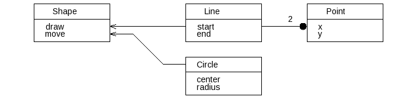

aafigure filter for AsciiDoc
============================

Aafigure (link:http://https://launchpad.net/aafigure[]) is an application for
ASCII line art to image conversion. Using the AsciiDoc aafigure filter, ASCII
line art can be embedded into AsciiDoc documents and processed into either PNG
bitmap or SVG vector graphics.

For example this ASCII text:

[listing]
.....................................................................
    +---------+         +---------+     +---------+
    |  Shape  |         |  Line   |     |  Point  |
    +---------+         +---------+   2 +---------+
    | draw    +<--------+ start   +----O+ x       |
    | move    +<-+      | end     |     | y       |
    +---------+   \     +---------+     +---------+
                   \
                    \   +---------+
                     +--+ Circle  |
                        +---------+
                        | center  |
                        | radius  |
                        +---------+
.....................................................................

renders:

More information and examples can be found on the link:asciidoc-aafigure-readme.html[README page].